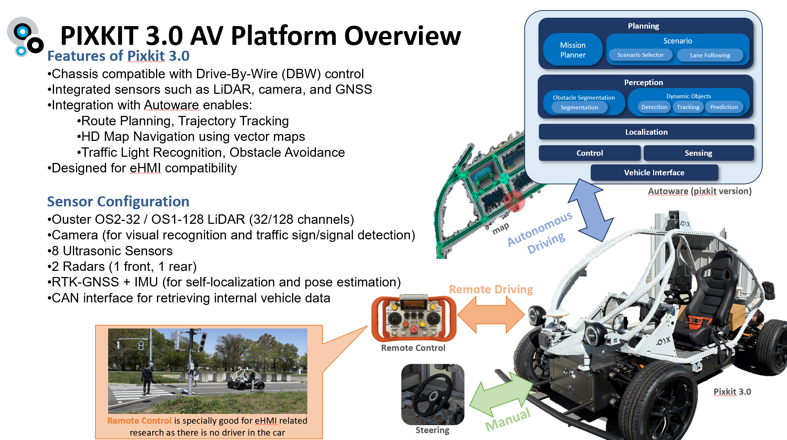
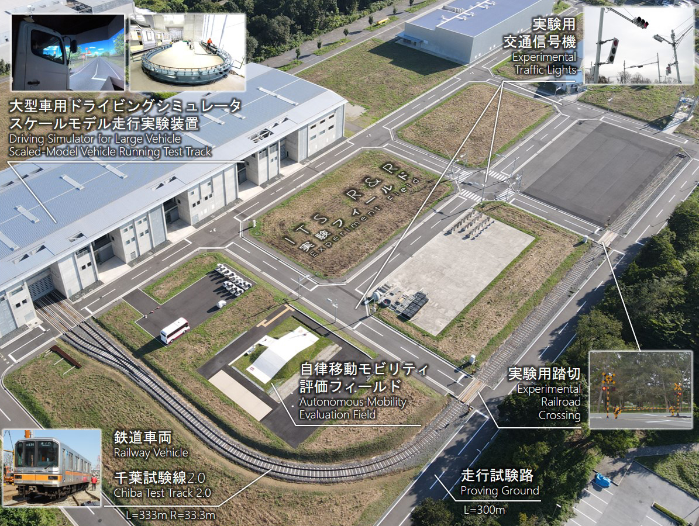

# URT-Kashiwa Dataset

The **URT-Kashiwa Dataset** (Unprotected Right Turn, Kashiwa Campus) is a collection of driving scenario recordings focused on **unprotected right turns**, a challenging maneuver for autonomous vehicles (equivalent to unprotected left turns in Europe).  
The dataset was collected at the **Kashiwa Campus of the University of Tokyo** using the **Pixkit 3.0 platform**, and includes interactions with **one pedestrian** and **one opponent vehicle** across **16 different routes**.

© 2025 Tsukada Laboratory (T-Lab), The University of Tokyo  
Contributors: Ehsan Javanmardi, Dongyang Li, Manabu Tsukada  

---

## ✨ Key Features
- **Scenario focus**: Unprotected right turns (≈ unprotected left turns in Europe).  
- **Platform**: Pixkit 3.0 autonomous vehicle research platform.  
- **Location**: Kashiwa Campus, The University of Tokyo.  
- **Actors**: One pedestrian and one opponent vehicle per route.  
- **Routes**: 16 recorded routes with diverse interactions.  
- **Format**: ROS 2 bag files (rosbag), compatible with ROS 2 Humble.

---

## 📂 Dataset Access
👉 [Download the dataset here](https://drive.google.com/drive/folders/1HnDjHkm7w1klh856-SmEVJ6OELNnHj0L?usp=sharing)  

---

## 📹 Demonstration
- **Video overview**: [](https://www.youtube.com/watch?v=1Q1ENXNBhKM)
- **Pixkit 3.0 platform**:  
    
- **Kashiwa Campus**:  
    

---

## 📑 Data Structure and Topics

### Autoware-specific messages
- **/vehicle/status/control_mode** — Current control mode (AUTONOMOUS=1, MANUAL=4, etc.)  
- **/vehicle/status/gear_status** — Gear status (0–24)  
- **/vehicle/status/velocity_status** — Ego vehicle velocity report  
- **/vehicle/status/steering_status** — Ego vehicle steering report  
- **/vehicle/status/actuation_status** — Acceleration & brake report  

### Standard ROS 2 messages
**Sensing**
- LiDAR:  
  - `/sensing/lidar/top/ouster/points` — Raw pointcloud  
  - `/sensing/lidar/top/ouster/metadata` — Metadata  
  - `/sensing/lidar/concatenated/pointcloud` — Processed pointcloud  
- Camera:  
  - `/sensing/camera/traffic_light/image_raw` — Front camera RGB images  
  - `/sensing/camera/traffic_light/camera_info` — Camera info  
- GNSS: `/sensing/gnss/fix`, `/sensing/gnss/pose`, `/sensing/gnss/pose_with_covariance`, `/sensing/gnss/chc/pitch`  
- IMU: `/sensing/gnss/chc/imu` — Raw IMU data  
- Twist: `/sensing/vehicle_velocity_converter/twist_with_covariance` — Ego vehicle twist  

**Localization**
- `/localization/pose_estimator/pose` — Ego pose (Autoware)  
- `/localization/kinematic_state` — Odometry (Autoware)  
- `/localization/pose_twist_fusion_filter/twist` — Ego twist (Autoware)  
- `/localization/acceleration` — Ego acceleration  
- `/localization/debug/ellipse_marker` — Localization error ellipse  

**Perception**
- `/perception/occupancy_grid_map/map` — Occupancy grid map  
- `/perception/object_recognition/prediction/maneuver` — Obstacle recognition & prediction  

**Planning**
- `/planning/scenario_planning/status/stop_reason` — Stop reason information  

**Diagnostics**
- `/diagnostic/planning_evaluator/metrics`  
- `/diagnostics`, `/diagnostics_err`, `/diagnostics_toplevel_state`  

---

## ⚙️ Usage Instructions

### Install ROS 2 Humble
Follow the official guide: [ROS 2 Humble Installation](https://docs.ros.org/en/humble/Installation/Ubuntu-Install-Debs.html)

### Build essential Autoware message packages
```bash
colcon build --symlink-install --cmake-args -DCMAKE_BUILD_TYPE=Release --packages-select \
pix_hooke_driver autoware_adapi_v1_msgs autoware_auto_geometry_msgs autoware_auto_mapping_msgs \
autoware_common_msgs autoware_lint_common tier4_planning_msgs autoware_auto_planning_msgs \
tier4_control_msgs tier4_system_msgs autoware_auto_vehicle_msgs tier4_api_msgs tier4_vehicle_msgs \
ros2_socketcan raw_vehicle_cmd_converter autoware_auto_control_msgs tier4_debug_msgs \
autoware_auto_perception_msgs autoware_cmake tier4_autoware_utils interpolation \
pix_hooke_driver_msgs pixkit_launch
```

### Play rosbag
```bash
ros2 bag play /bagfilepath/bagfilename
```

### Visualize in RViz
```bash
ros2 run rviz2 rviz2 -d civ.rviz
```

### Inspect messages
```bash
ros2 topic list
ros2 topic info -v /topicname
ros2 topic echo /topicname
```

---

## 📜 License
This dataset is licensed under the [Creative Commons Attribution 4.0 International (CC BY 4.0)](https://creativecommons.org/licenses/by/4.0/).  


